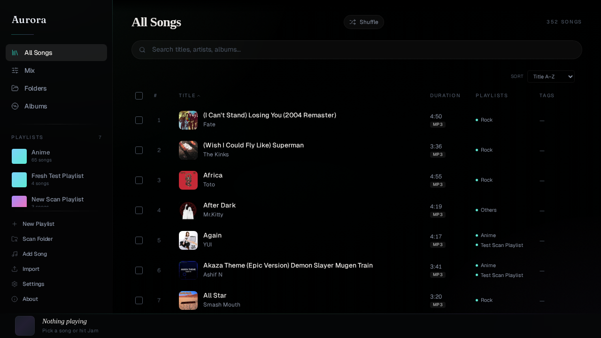
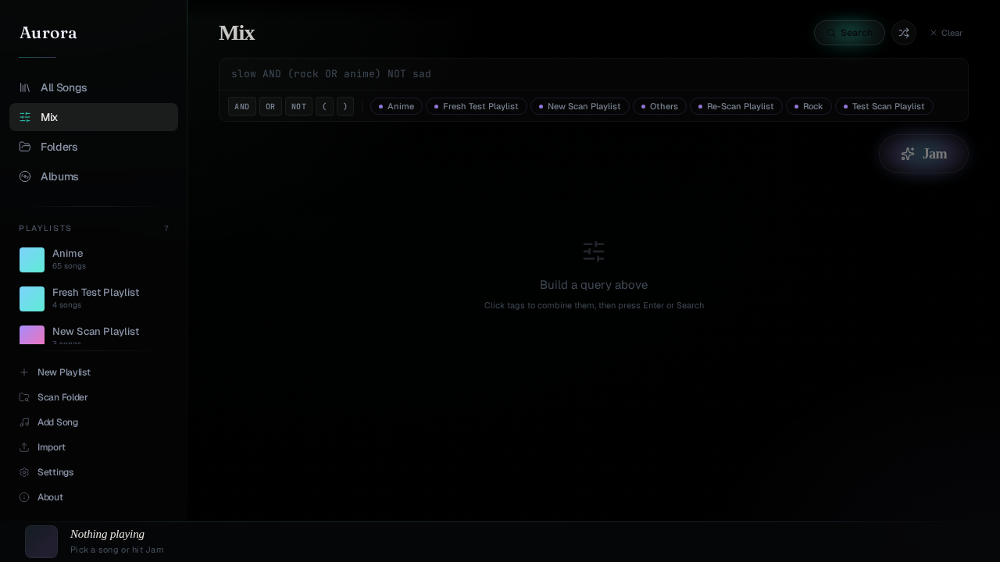
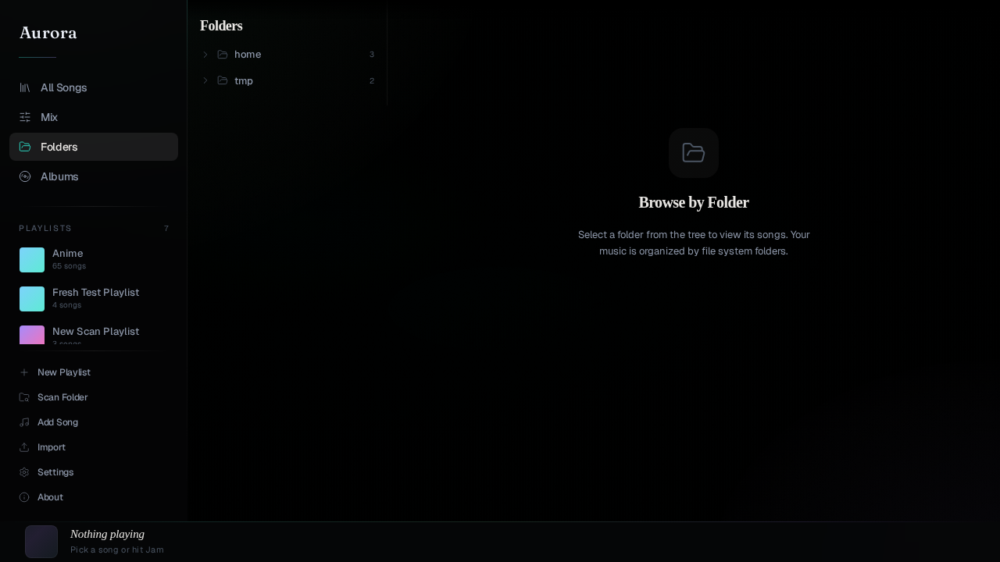
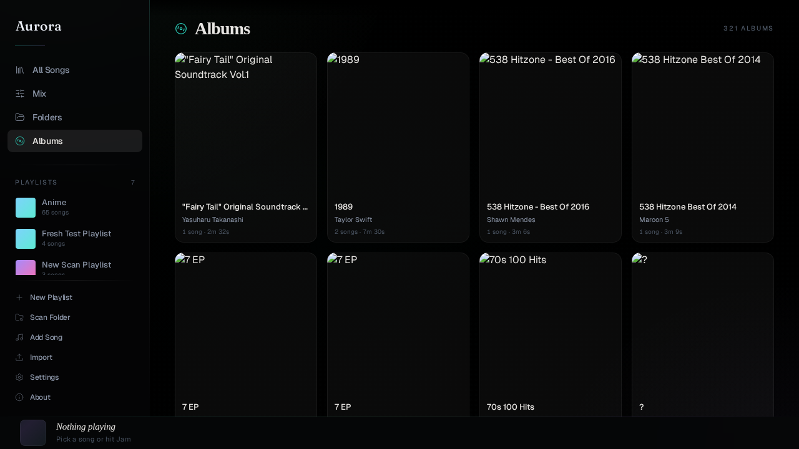
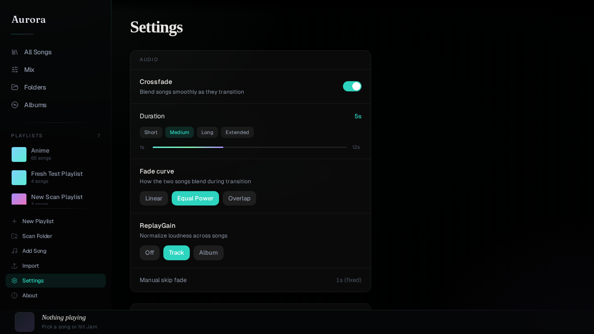

# Aurora

A personal music library with smart tagging, boolean filtering, and a built-in audio player.



## Features

- **Smart Boolean Filtering** — query your library with AND, OR, NOT, and parentheses (e.g. `tag:electronic AND bpm:>120 NOT artist:drake`)
- **Custom Tagging** — create and assign tags to any song, filter by combinations
- **Playlist Management** — create playlists, drag-to-reorder songs, per-song trim points
- **Album View** — browse your library by album with cover art grid
- **Waveform Trim Editor** — visual waveform display with draggable start/end handles for per-song trim points
- **Crossfade** — configurable crossfade between tracks with linear, equal-power, and overlap curves
- **Gapless Playback** — preloading for seamless track transitions
- **ReplayGain Normalization** — track and album gain modes to keep volume consistent
- **Multi-Select** — select multiple songs for bulk tagging, adding to playlists, or queue operations
- **Auto-Watch** — register folders to automatically detect and import new music files
- **Playlist Export/Import** — export playlists as `.m3u` / `.m3u8`, import from file
- **Folder Browser** — tree-view navigation of your music directory structure
- **Queue Management** — play next, add to queue, drag-to-reorder, history
- **Keyboard Shortcuts** — 16+ shortcuts for power users (press `?` to see all)
- **Dark Mode UI** — single dark theme with per-song color bleed and glass surfaces

## Screenshots

| | |
|---|---|
|  |  |
|  |  |
|  |  |

## Tech Stack

**Backend**
- Python 3.11+
- FastAPI + Uvicorn
- SQLite (WAL mode)
- Mutagen (audio metadata), Miniaudio (waveform peaks), Pillow (album art)

**Frontend**
- React 19 + TypeScript
- Vite
- Tailwind CSS 4 + shadcn/ui
- Zustand (state management)
- Howler.js (audio playback)
- Motion (animations)
- Lucide (icons)

## Prerequisites

- Python 3.11+
- Node.js 18+
- npm (or pnpm)

## Quick Start

```bash
# Backend
cd backend
python -m venv venv
source venv/bin/activate   # Windows: venv\Scripts\activate
pip install -r requirements.txt
python run.py
```

In a second terminal:

```bash
# Frontend
cd frontend
npm install
npm run dev
```

Then open **http://localhost:5173** in your browser.

The backend API runs on **http://localhost:8000** with Swagger docs at **http://localhost:8000/docs**.

## Configuration

**Environment**

The backend uses a local SQLite database (`aurora.db`) created automatically on first run. No external database setup required.

**Scanning Music**

1. Click the scan button in the sidebar or press `S` to open Settings
2. Enter the path to your music folder
3. Optionally enable "Auto-watch this folder" to detect new files automatically
4. Run the scan

**Audio Settings** (accessible in the UI settings panel)

- Crossfade: enable/disable, duration (1–12 seconds), curve type
- ReplayGain: off, track gain, or album gain mode

All settings persist in localStorage.

## Development

```bash
# Backend tests
cd backend
source venv/bin/activate
python -m pytest tests/ -v

# Frontend build (includes type-check)
cd frontend
npm run build

# Frontend type-check only
cd frontend
npx tsc --noEmit

# Frontend lint
cd frontend
npm run lint
```

## Desktop App (Tauri)

Aurora ships as a native desktop app via Tauri 2. The backend is frozen with PyInstaller and bundled as a sidecar — no Python installation required for end users.

### Features

- **Auto-updater** — on startup, Aurora checks for new releases and shows a toast notification with an Install button. On Linux (deb), the Install button opens the GitHub release page in your system browser. On Windows, updates download and install automatically.
- **Single-instance** — launching Aurora when it's already running focuses the existing window instead of opening a second instance.
- **Sidecar backend** — the Python backend spawns automatically on a free port with a random auth token. No manual backend start needed.

### Dev Loop

```bash
# 1. Freeze the backend (one-time, or after backend changes)
cd backend
source venv/bin/activate
pyinstaller aurora-backend.spec --distpath dist --workpath build -y

# 2. Launch Tauri dev (starts Vite + Rust compile + sidecar)
cd frontend
npx tauri dev
```

The Tauri app spawns the frozen backend on a free port, waits for health, then injects `window.__AURORA_BASE_URL__` via `initialization_script` before creating the window.

### CI Artifacts

Pushing a `v*` tag triggers signed release builds (`.deb` + `.exe` + updater artifacts). `workflow_dispatch` builds unsigned artifacts for testing:

```bash
gh workflow run "Desktop Build" --ref main
```

### Install (Linux)

**From .deb (direct download):**

```bash
sudo dpkg -i Aurora_0.1.1_amd64.deb
# Then run: Aurora
```

**From AUR (Arch Linux):**

```bash
# Build from source (aurora-git)
git clone https://aur.archlinux.org/aurora-git.git
cd aurora-git
makepkg -si
```

See [`packaging/aur/README.md`](packaging/aur/README.md) for details.

The backend binds to `127.0.0.1` by default. For LAN/mobile access: `AURORA_HOST=0.0.0.0 Aurora`.

## Keyboard Shortcuts

| Key | Action |
|-----|--------|
| `Space` | Play / Pause |
| `→` | Next track |
| `←` | Previous track |
| `N` | Next track |
| `P` | Previous track |
| `M` | Mute / Unmute |
| `L` | Toggle shuffle |
| `R` | Cycle repeat mode (off → all → one) |
| `S` | Toggle settings panel |
| `[` | Decrease volume 5% |
| `]` | Increase volume 5% |
| `/` | Focus filter search input |
| `1`–`9` | Switch to playlist 1–9 |
| `?` | Show keyboard shortcuts overlay |
| `Esc` | Close dialog / command palette, blur input |
| `Ctrl+F` / `⌘F` | Focus filter search input |
| `Ctrl+K` / `⌘K` | Open command palette |

All shortcuts are disabled while typing in an input field (except `Esc`).

## Project Structure

```
Aurora/
├── backend/
│   ├── app/
│   │   ├── routers/       # FastAPI routes (songs, tags, playlists, filter, scanner, folders, watcher)
│   │   ├── services/      # Filter engine, file scanner, file watcher
│   │   ├── models.py      # Pydantic models
│   │   ├── database.py    # SQLite schema + migrations
│   │   └── main.py        # FastAPI app
│   ├── tests/
│   └── run.py             # Entry point
├── frontend/
│   └── src/
│       ├── components/    # React components (player, playlists, settings, etc.)
│       ├── stores/        # Zustand stores (song, player, playlist, filter, tag, settings)
│       ├── hooks/         # Audio player, keyboard shortcuts, waveform
│       ├── lib/           # API client, utilities
│       └── types/         # TypeScript types
└── docs/                  # Design specs and implementation plans
```

## License

MIT
